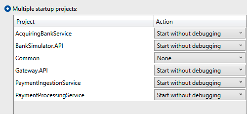
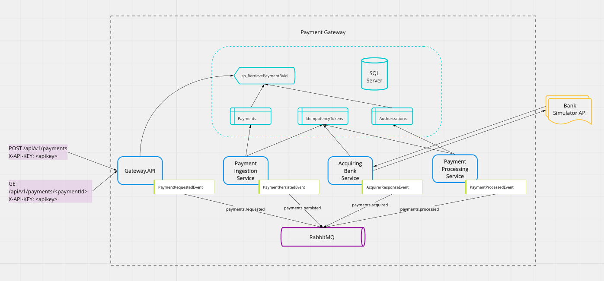
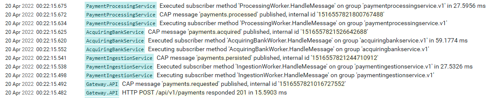
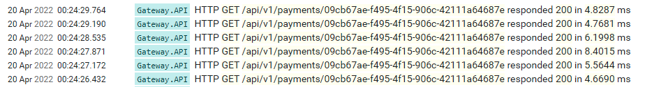

# To Build the Solution

Navigate to the root folder, i.e. the folder with Checkout.sln in it:

**`docker-compose -f "docker-compose.yml" up -d --build`**

Then in the package manager console of Visual Studio:

**`dotnet ef database update --project PaymentIngestionService`**

**`dotnet ef database update --project PaymentProcessingService`**

Docker setup of the .NET applications was not reliable enough on my M1 Mac, so you'll need to set multiple startup projects in Visual Studio and run from there:



Ctrl + F5 to run all the services

---

## Links

[Seq logging](http://localhost:5341)

[RabbitMQ admin console](http://localhost:15672)

[BankSimulator.API Swagger UI](https://localhost:7209/swagger/index.html)

[Gateway.API Swagger UI](https://localhost:7099/swagger/index.html)

---

# Project structure

- *Gateway.API*
  - The public entrypoint to the gateway
  - Exposes POST and GET endpoints on /api/v1/payments
    - POST does nothing but publish a message to kick off the flow
    - GET calls a stored procedure to retrieve payment details from the DB
  - Requests are let through when a valid X-API-KEY header value is present
- *PaymentIngestionService*
  - Persists the request to the DB
- *AcquiringBankService*
  - Calls the external Bank API (simulated in this case)
- *BankSimulator.API*
  - Mocked, randomised responses
- *PaymentProcessingService*
  - Persists the acquiring bank response authorization to the DB




---

# Assumptions

- The POST endpoint need not provide the full response of the processed payment.
- The GET endpoint serves as a status monitor. Only when the back-end payment process has been completed will the payment details reflect the full response.
- The bank simulator need only return mocked responses, and does not need to validate incoming requests or return accurate data like card schemes or bin numbers corresponding to the inputted card number.

---

# Thought process

## Architecture decision
Since the processing of payments requires a number of parties and steps, I decided to leverage an event driven architecture. The process endpoint merely publishes a message to kick off the back-end flow. The response provides the generated payment ID, a status to indicate that the payment is ‘Processing’, and in the location header, a URL which points to the retrieval endpoint.


From there the client can poll until they receive confirmation that the payment has been successfully processed.

## Separation

> The rule of thumb is to not combine database and network calls. 

To achieve this, I have separated persistence to the database and calls to the external acquiring bank API by using message queues and separate microservice processes.

A problem we run into when building event driven solutions is that while we can achieve atomicity by using database traction transactions, we can’t then publish a message to a message queue outside of that. In the event of a database/server outage or dropped connection or other error, publishing to the message broker before or after the transaction could lead to:
- broadcasting that something has been persisted to the database when it actually hasn't
- persisting something to the database but never broadcasting that we did it
  
To solve this I've used an open source project called [CAP](https://github.com/dotnetcore/CAP). It uses the transaction outbox pattern to wrap message publishing into the database transaction. It saves the message to a database table and an external process picks that up and publishes it to the message queue. By utilising this, we can achieve at least once delivery. 

This external process that picks up the messages could end up performing multiple deliveries of the same message. To counteract this I have created a database table called `IdempotencyTokens`. Just before a database transaction is committed, it adds an entry to this token table which includes the message ID and consumer name. The primary key of this table is a composite key of both of these columns which will in turn have a unique index applied to it. The reason we want uniqueness in tandem with the consumer name is because we don’t want to prevent future consumers from subscribing to a topic in the message bus. The RabbitMQ exchange type used in this project is direct, but we don't want to prevent topic / fan-out subscriptions.

The correlation ID set on the messages is the payment ID, so that we can stitch together how things rippled through the system if needed.


# Findings

## CAP
The CAP library has been very easy to set up and integrate with both the database and message broker, but the way it works is not that intuitive. For example the first publisher is ostensibly publishing a message to a queue called `payments.requested`. I assumed that would correspond to the RabbitMQ routing key, but when you look at the RabbitMQ admin console, it has actually created a queue under the assembly name of the **consuming service** that is subscribed to `payments.requested`, i.e. `paymentingestionservice`. Also, it expects certain message headers which may not be that easily applied if a message is coming from a non-CAP producer. I also don’t love that subscribing methods need to subscribe via attribute routing. There is an option to configure your own discovery in a more fluent way, but the documentation doesn’t elaborate on how to do so.


If I were to Utilise the transaction outbox Pattern in a production solution I might opt to roll our own outbox processing solution, rather than relying on a third-party one one which is not that extensible. Another option would be to use document storage like Azure CosmosDB which has a change feed that can be subscribed to, and events can be read that way. 

## PII data
Since credit card information is obviously very sensitive data, I have utilised the [Microsoft DataProtection API](https://docs.microsoft.com/en-us/dotnet/standard/security/how-to-use-data-protection) to protect the card number and CVV. It is possible in theory for separate processes to share the same data protection keys to enable one service to encrypt data and another service to decrypt it, but I couldn’t get it working in time. The code that protects and unprotects is commented out for now.

## Data access
I have used EntityFrameworkCore as the ORM in this project, although I would not choose to use it in production code. It allows for ease of prototyping for a proof of concept like this but it is not performant at scale and using data migrations are not always conducive to a good development experience, especially within a team. 

---

# Production scenario

### Performance

If I were to productionise this solution, I would likely choose Apache Kafka as my message broker due to its ability to scale at enterprise level. I have much experience with Azure Service Bus but in the absence of a docker image, I chose RabbitMQ. The mechanisms of message routing and consumption differ greatly between RabbitMQ and Kafka so the solution would need to change to accomodate that. We'd need to look at implementing dead letter queues and distinguish between transient errors and actual poison pill messages, such as malformed / invalid ones. These could never succeed despite retrying, so a DLQ with some monitoring / alerting attached, could prompt a human to take a look.

For the payment details retrieval endpoint it could be useful to add a caching layer which would be write-through. Currently, if you try to call the GET endpoint immediately after the POST, you'd get a NotFound result which obviously doesn't represent the truth. Fortunately the requests perform well, but when deployed it could cause a problem, and unhappy paths would need to be extensively tested.

The process result returns in ~15ms and the backend flow is complete in ~200ms



Retrieving responds in ~6ms




At the moment, retrieval calls a stored procedure via Dapper to get info from the database. The stored procedure aggregates the Payments and Authorizations tables together. In a production scenario, this data might not be in the same logical space, either geographically or topographically, or at least not in the same database schema, since we’d aim to have the separation of bounded contexts. Another microservice for aggregating the data might need to be implemented. For now the SP is fine and at least will be a little more optimised than a straight query.

### Authentication
The authentication is very crude at the moment. It checks for the presence of an `X-API-KEY` header in the request and then looks for a corresponding key in appsettings.json. In reality we’d utilise something like Azure API Management. It serves as an API gateway to route, load balance and rate limit requests, as well as handling the verification of API keys.

### Validation

For validation on the Gateway API, FluentValidation has been used as I’ve used it extensively and it’s always been flexible and reliable enough, and most importantly, easy to unit test against.

The payment request amount is an integer to represent pennies or whatever the lowest denomination is for a currency, since we don’t want to rely on decimal serialization / rounding errors. There is no validation on the currency yet, but there’d be a cached list of supported currencies in a production setting, perhaps with feature toggles on them to suspend if needed.

### Logging

Logging is done via the Serilog framework, and uses the Seq sink to provide us with a UI where we can query the logs generated from the applications. In production I'd use the ELK stack with Kibana and Grafana for dashboards and alerts.

### VS solution

In the solution is a Common class library with a handful of extension methods and things relating to DI and the CAP library. In production we’d create a Nuget package since it’s unlikely the services would all be kept in a monorepo such as the one I’ve created.

### Database scaling

While we could vertically scale the DB, there is a physical limit to doing so. Horizontal scaling with read replicas would be an option, or partitioning. Choosing a partition key is not always easy to do, but using the Merchant ID would make sense here. Since you wouldn't be able to perform joins on partitioned tables, it would be good to implement an AnalyticsService with a fan-out messaging system, so that it could pump information to say a data lake, where BI could be gleaned from that rather than querying the actual DB and possibly affecting performance for customers.


# Requests and Responses
Gateway API

POST Request
```bash
curl -X 'POST' \
  'https://localhost:7099/payments' \
  -H 'accept: text/plain' \
  -H 'X-API-KEY: pgH7QzFHJx4w46fI5Uzi4RvtTwlEXp' \
  -H 'Content-Type: application/json' \
  -d '{
  "cardDetails": {
    "cardNumber": "5105105105105100",
    "expiryDate": {
      "month": 4,
      "year": 2025
    },
    "cvv": "123"
  },
  "amount": {
    "currency": "GBP",
    "value": 10000
  }
}'
```
Response

```bash
{
  "id": "57272fc8-a466-480d-9a2c-ddff32b0f4d0",
  "status": "Processing"
}
```

GET Request
```bash
curl -X 'GET' \
  'https://localhost:7099/api/v1/payments/16769f4c-a730-4f05-b8ec-0f45c22375b0' \
  -H 'accept: text/plain' \
  -H 'X-API-KEY: pgH7QzFHJx4w46fI5Uzi4RvtTwlEXp'
```

Response

```json
{
  "paymentId": "16769f4c-a730-4f05-b8ec-0f45c22375b0",
  "currency": "GBP",
  "amount": 100,
  "approved": false,
  "status": "Pending",
  "responseCode": "3542",
  "responseSummary": "Authorized",
  "type": "Card",
  "scheme": "Visa",
  "expiryMonth": 4,
  "expiryYear": 2025,
  "last4": "5100",
  "bin": "424242",
  "cardType": "Credit",
  "issuer": "Starling",
  "issuerCountry": "US"
}
```

---

Bank Simulator API

Request

```bash
curl -X 'POST' \
  'https://localhost:7209/process' \
  -H 'accept: application/json' \
  -H 'Content-Type: application/json' \
  -d '{
  "cardNumber": "4111111111111111",
  "expiryMonth": 6,
  "expiryYear": 2023,
  "cvv": "123",
  "currency": "USD",
  "amount": 1000
}'
```

Response

```json
{
  "responseId": "0255227f-1dfc-4d7c-b8ef-0fe49c711b02",
  "amount": 1000,
  "currency": "USD",
  "approved": true,
  "status": "Pending",
  "responseCode": "45543",
  "responseSummary": "Authorized",
  "source": {
    "type": "Card",
    "expiryMonth": 6,
    "expiryYear": 2023,
    "scheme": "Mastercard",
    "last4": "1111",
    "bin": "424242",
    "cardType": "Debit",
    "issuer": "HSBC",
    "issuerCountry": "DA"
  },
  "processedOn": "2022-04-19T21:18:59.953538Z"
}
```